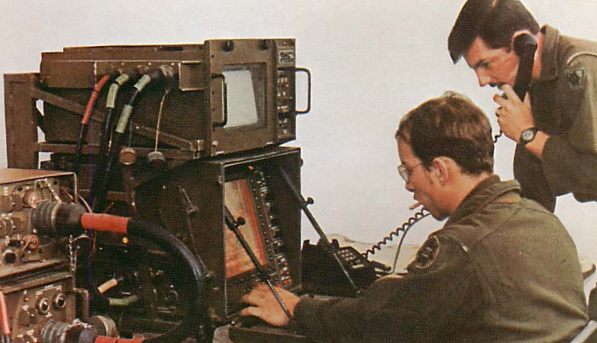

<div align="center">



# AUFTRAGSTAKTIK

**Live frontlines. Aircraft transponders. Ship tracking. Air defense envelopes. Radar coverage. Military installations. Nuclear facilities. Conflict events. Translated intel from military Telegram channels. Historical conflict archives. One terminal. NATO symbology. All OSINT.**

*Named for the German doctrine of mission-type tactics: give the objective, let subordinates figure out execution.*


</div>

---

## Capabilities

| | |
|---|---|
| **Tactical Map** | Dark or light basemap. 9 togglable layers: frontlines, aircraft, ships, air defense, installations, radar, nuclear, conflict events, density heatmap. Click any marker for detail panels with Wikipedia links. |
| **Intelligence Feed** | GeoConfirmed events and Telegram posts (auto-translated). Filter by source or severity. Click to fly the map there. Export as JSON or CSV. |
| **Briefing Generator** | Local LLM (Ollama) produces structured SITREPs from aggregated intelligence. Location summaries, faction breakdown, equipment losses, source attribution. Export as PDF. No API costs. |
| **Air Defense Layer** | OSINT-confirmed SAM/AD installations with engagement envelopes. S-400 at 400km, Patriot at 160km, Iron Dome at 70km. Coverage zones and gaps visible at a glance. |
| **Installations Layer** | 35 military bases, naval ports, HQs, logistics hubs, and strategic chokepoints (Hormuz, Bab el-Mandeb, Suez, Malacca) across 4 theaters. NATO symbology with friendly/hostile affiliation. |
| **Radar / Sensors** | 20 radar sites from Voronezh early warning (6000km) to coastal surveillance. Purple range rings show detection and tracking envelopes. |
| **Nuclear / CBRN** | Known nuclear facilities — reactors, enrichment plants, weapons storage, test sites. Yellow exclusion zones. CBRN keywords in events auto-escalate to critical severity. |
| **Historical Mode** | 140,000+ archived events from UCDP GED (1989-2023). Five theaters: Yugoslav Wars, Gulf War, Iraq War, Afghanistan, Syrian Civil War. Cumulative playback with year-based color gradient, fatality-scaled markers, running KIA counter, and Wikipedia/news archive links. |

---

## Screenshots

**Ukraine Theater** — Frontlines, conflict events, air defense range rings, Telegram feed


**Middle East Theater** — Israel/Syria/Iran/Yemen events, aircraft, AD coverage zones


**Briefing Generator** — Ollama-powered SITREP with PDF export


---

## Data Sources

| Source | Tracks | Auth |
|--------|--------|------|
| [DeepState](https://deepstatemap.live) | Frontline positions, occupied territory, unit deployments | None |
| [GeoConfirmed](https://geoconfirmed.org) | Verified conflict events (strikes, shelling, clashes) | None |
| [adsb.lol](https://adsb.lol) | Aircraft positions via ADS-B, military and civilian | None |
| [aisstream.io](https://aisstream.io) | Ship positions via AIS, military vessel classification | Free API key |
| Telegram channels | Military blogs (Rybar, DeepState UA, WarGonzo), auto-translated | None |
| OSINT databases | Air defense sites, military installations, radar systems, nuclear facilities | None (curated) |
| [UCDP GED](https://ucdp.uu.se) | Historical conflict events, 1989-2023. Georeferenced, global. CC BY 4.0 | None |

All external calls route through the server. Keys stay server-side.

---

## Theaters

Eleven theaters total — six live, five historical. Switching theaters rescopes the map, data sources, feed, and briefings.

**Live** (real-time data):
- **Ukraine** — Frontlines (DeepState), aircraft, Black Sea maritime, conflict events, Telegram blogs
- **Middle East** — Israel/Gaza, Lebanon, Syria, Iran, Yemen. Persian Gulf and Red Sea maritime
- **Baltic / N. Europe** — Kaliningrad, Baltic Sea, Finland border, Norwegian Coast
- **East Asia / Pacific** — Korean Peninsula, Taiwan Strait, South China Sea
- **Africa** — Sahel, Horn of Africa, Sudan, DR Congo, Libya, Mozambique
- **Myanmar** — Shan, Kachin, Rakhine, Sagaing conflict zones

**Historical** (UCDP archival data):
- **Yugoslav Wars (1991-2001)** — Croatia, Bosnia, Kosovo, Serbia
- **Gulf War (1990-1991)** — Iraq/Kuwait, Desert Storm
- **Iraq War (2003-2011)** — Baghdad, Anbar, Basra, Kurdistan
- **Afghanistan War (2001-2021)** — Kabul, Helmand, Kandahar, Nangarhar
- **Syrian Civil War (2011-2023)** — Aleppo, Idlib, Damascus, Deir ez-Zor, Raqqa

Add a new theater by writing a config object in `src/lib/theaters/index.ts`.

---

## Setup

### Option A: Run locally

**You need:** [Node.js 18+](https://nodejs.org) and [Git](https://git-scm.com).

```bash
git clone https://github.com/lerugray/auftragstaktik.git
cd auftragstaktik
npm install
cp .env.example .env.local
```

Edit `.env.local` and add your AIS key (free at [aisstream.io](https://aisstream.io), sign in with GitHub). Ship tracking needs it. Everything else works without keys.

```bash
npm run dev
```

Open `http://localhost:3117`.

### Option B: Docker

**You need:** [Docker](https://docker.com) installed.

```bash
git clone https://github.com/lerugray/auftragstaktik.git
cd auftragstaktik
cp .env.example .env.local
# Edit .env.local with your AIS key
docker compose up
```

This starts the app and an Ollama instance together. After startup, pull a model for briefings:

```bash
docker exec -it auftragstaktik-ollama-1 ollama pull llama3
```

Open `http://localhost:3117`.

### Enable briefings (local setup only)

The SITREP generator runs on [Ollama](https://ollama.com), a free local AI. Without it, everything else works — you just can't generate briefings.

```bash
# Install Ollama from https://ollama.com, then:
ollama pull llama3
```

The briefing panel auto-detects Ollama. Select a scope, timeframe, and click GENERATE SITREP. Export the result as PDF.

### Troubleshooting

- **"Cannot find module" errors** — Delete `.next` and restart: `rm -rf .next && npm run dev`
- **Port 3117 in use** — Another instance is running. Kill it: `npx kill-port 3117`
- **No ship data** — Check your `AISSTREAM_API_KEY` in `.env.local`
- **No aircraft near conflict zones** — Airspace is closed in active war zones. Aircraft show around the edges (Poland, Romania, Turkey for Ukraine)

---

## Keyboard Shortcuts

| Key | Action |
|-----|--------|
| `1` | Toggle frontlines |
| `2` | Toggle aircraft |
| `3` | Toggle air defense |
| `4` | Toggle installations |
| `5` | Toggle radar / sensors |
| `6` | Toggle nuclear / CBRN |
| `7` | Toggle heatmap |
| `8` | Toggle maritime |
| `9` | Toggle events |
| `Esc` | Close detail panel |

---

## Tech Stack

- **Next.js 15** — App Router, TypeScript, server-side API routes
- **Tailwind CSS v4** — Dark tactical theme + light/high-contrast mode
- **MapLibre GL JS** — Vector map rendering, heatmap layers
- **milsymbol** — NATO MIL-STD-2525 symbol generation
- **Ollama** — Local LLM briefing generation (free)
- **@react-pdf/renderer** — PDF SITREP export
- **translatte** — Telegram post translation

---

## Related: Sandkasten

**[Sandkasten](https://github.com/lerugray/sandkasten)** is a sister project — an open-source wargame simulation built on Auftragstaktik's map and symbology. Think Command: Modern Operations, but open-source, community-driven, and able to pull real-world OSINT snapshots as playable scenarios.

---

## License

MIT

---

*Built with [Claude Code](https://claude.ai/claude-code).*
