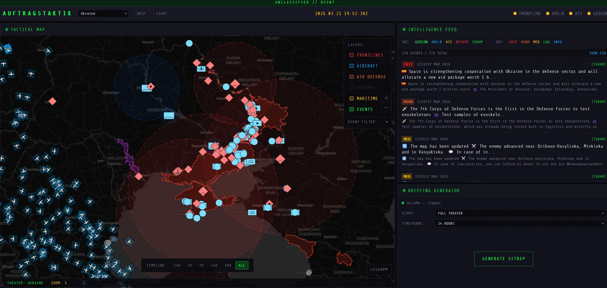
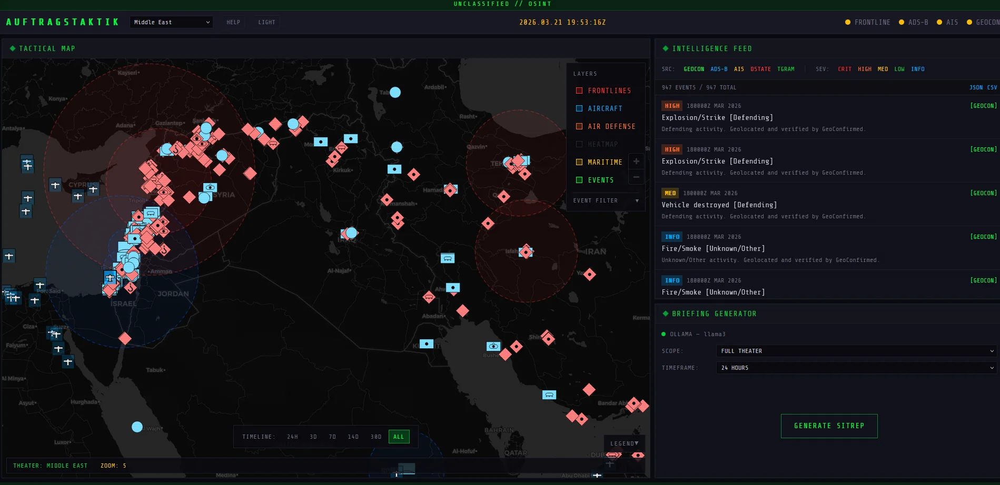
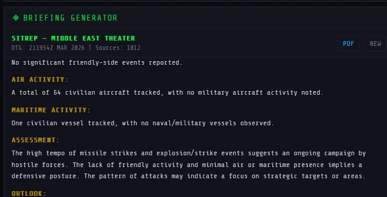

# AUFTRAGSTAKTIK

**Tactical OSINT terminal. Live frontlines, aircraft, ships, air defense coverage, and conflict events on one display with NATO military symbology.**


---

## What This Does

Auftragstaktik pulls live data from open sources and renders it on a tactical map. Frontline positions from DeepState. Aircraft transponders from ADS-B. Ship positions from AIS. Conflict events from GeoConfirmed. Translated military blog posts from Telegram. All markers use MIL-STD-2525 NATO symbols.

The name comes from the German doctrine of mission-type tactics: give the objective, let subordinates figure out execution.

### Capabilities

**Tactical Map.** Dark or light basemap with togglable layers: frontlines, aircraft, ships, air defense installations with range rings, conflict events, density heatmap. Click any marker for a detail panel. Aircraft types and vessel classes link to Wikipedia.

**Intelligence Feed.** Scrolling event stream from GeoConfirmed and Telegram channels (auto-translated). Filter by source or severity. Click an event to fly the map there — the marker pulses so you can spot it. Export filtered data as JSON or CSV.

**Briefing Generator.** Feeds aggregated intelligence to a local LLM (Ollama) and produces a structured SITREP with location summaries, faction breakdown, equipment losses, and source-attributed reporting. Export as PDF. No API costs.

**Air Defense Layer.** OSINT-confirmed SAM/AD installations with engagement range rings. S-400 at 400km, Patriot at 160km, Iron Dome at 70km. Coverage overlaps and gaps are visible at a glance.

---

## Screenshots

**Ukraine Theater** — Frontlines, conflict events, air defense range rings, Telegram feed


**Middle East Theater** — Israel/Syria/Iran/Yemen events, aircraft, AD coverage zones


**Briefing Generator** — Ollama-powered SITREP with PDF export


---

## Data Sources

| Source | Tracks | Auth |
|--------|--------|------|
| [DeepState](https://deepstatemap.live) | Frontline positions, occupied territory, unit deployments | None |
| [GeoConfirmed](https://geoconfirmed.org) | Verified conflict events (strikes, shelling, clashes) | None |
| [adsb.lol](https://adsb.lol) | Aircraft positions via ADS-B, military and civilian | None |
| [aisstream.io](https://aisstream.io) | Ship positions via AIS, military vessel classification | Free API key |
| Telegram channels | Military blogs (Rybar, DeepState UA, WarGonzo), auto-translated | None |
| OSINT databases | Air defense sites (S-400, Patriot, Iron Dome positions) | None (curated) |

All external calls route through the server. Keys stay server-side.

---

## Theaters

Six theaters, 37 sub-regions. Switching theaters rescopes the map, data sources, feed, and briefings.

- **Ukraine** — Frontlines (DeepState), aircraft, Black Sea maritime, conflict events, Telegram blogs
- **Middle East** — Israel/Gaza, Lebanon, Syria, Iran, Yemen. Persian Gulf and Red Sea maritime
- **Baltic / N. Europe** — Kaliningrad, Baltic Sea, Finland border, Norwegian Coast
- **East Asia / Pacific** — Korean Peninsula, Taiwan Strait, South China Sea
- **Africa** — Sahel, Horn of Africa, Sudan, DR Congo, Libya, Mozambique
- **Myanmar** — Shan, Kachin, Rakhine, Sagaing conflict zones

Add a new theater by writing a config object in `src/lib/theaters/index.ts`.

---

## Setup

### Option A: Run locally

**You need:** [Node.js 18+](https://nodejs.org) and [Git](https://git-scm.com).

```bash
git clone https://github.com/lerugray/auftragstaktik.git
cd auftragstaktik
npm install
cp .env.example .env.local
```

Edit `.env.local` and add your AIS key (free at [aisstream.io](https://aisstream.io), sign in with GitHub). Ship tracking needs it. Everything else works without keys.

```bash
npm run dev
```

Open `http://localhost:3117`.

### Option B: Docker

**You need:** [Docker](https://docker.com) installed.

```bash
git clone https://github.com/lerugray/auftragstaktik.git
cd auftragstaktik
cp .env.example .env.local
# Edit .env.local with your AIS key
docker compose up
```

This starts the app and an Ollama instance together. After startup, pull a model for briefings:

```bash
docker exec -it auftragstaktik-ollama-1 ollama pull llama3
```

Open `http://localhost:3117`.

### Enable briefings (local setup only)

The SITREP generator runs on [Ollama](https://ollama.com), a free local AI. Without it, everything else works — you just can't generate briefings.

```bash
# Install Ollama from https://ollama.com, then:
ollama pull llama3
```

The briefing panel auto-detects Ollama. Select a scope, timeframe, and click GENERATE SITREP. Export the result as PDF.

### Troubleshooting

- **"Cannot find module" errors** — Delete `.next` and restart: `rm -rf .next && npm run dev`
- **Port 3117 in use** — Another instance is running. Kill it: `npx kill-port 3117`
- **No ship data** — Check your `AISSTREAM_API_KEY` in `.env.local`
- **No aircraft near conflict zones** — Airspace is closed in active war zones. Aircraft show around the edges (Poland, Romania, Turkey for Ukraine)

---

## Keyboard Shortcuts

| Key | Action |
|-----|--------|
| `1` | Toggle frontlines |
| `2` | Toggle aircraft |
| `3` | Toggle air defense |
| `4` | Toggle heatmap |
| `5` | Toggle maritime |
| `6` | Toggle events |
| `Esc` | Close detail panel |

---

## Tech Stack

- **Next.js 15** — App Router, TypeScript, server-side API routes
- **Tailwind CSS v4** — Dark tactical theme + light/high-contrast mode
- **MapLibre GL JS** — Vector map rendering, heatmap layers
- **milsymbol** — NATO MIL-STD-2525 symbol generation
- **Ollama** — Local LLM briefing generation (free)
- **@react-pdf/renderer** — PDF SITREP export
- **translatte** — Telegram post translation

---

## License

MIT

---

*Built with [Claude Code](https://claude.ai/claude-code).*
